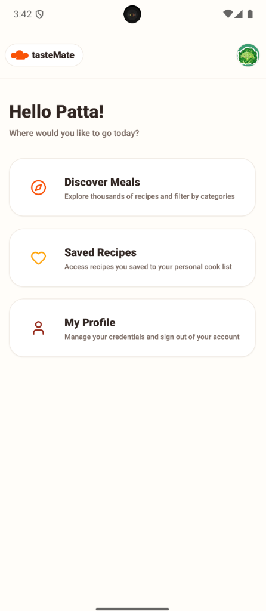
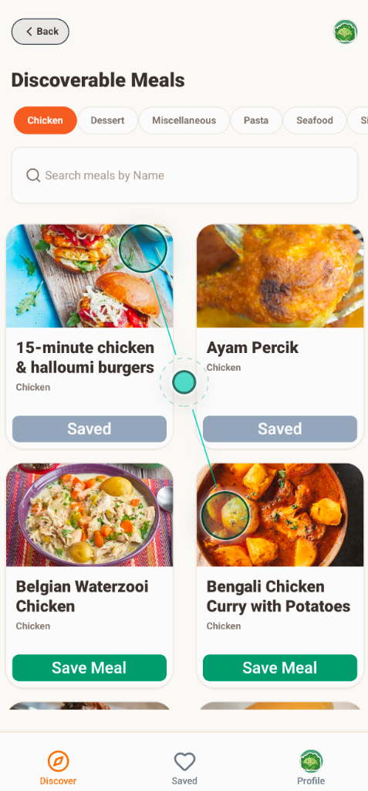
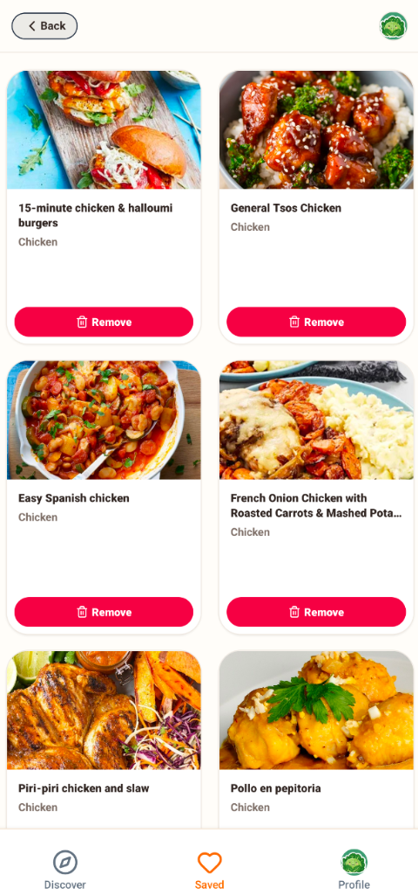
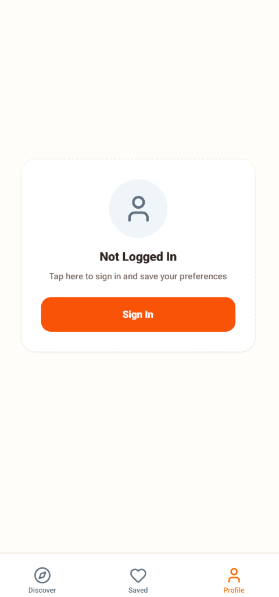

# tasteMate 🍳

tasteMate is a premium, cross-platform mobile recipe discovery and management application built using **Expo (React Native)**, **Clerk**, **Convex**, and **Zustand**. It allows users to explore thousands of meals, filter them by categories, search by name, and manage their personal saved collections securely with an advanced multi-select batch deletion interface.

---

## 📱 Screenshots

<p align="center">
  
  
  
  
</p>

---

## 🚀 Key Features

*   **Discover Portal (`app/index.tsx`)**: An entry landing dashboard welcoming the user with their name and custom outlined top bar brand headers, linking to key features.
*   **Discover Tab (`app/(tabs)/index.tsx`)**: Explore recipes dynamically using category filter pills (Chicken, Pasta, Dessert, etc.) and search input queries. Features robust grid cards displaying images, categories, and auth-guarded save capabilities.
*   **Saved Recipes Tab (`app/(tabs)/saving.tsx`)**:
    *   **Self-Healing Image Fallback**: Automatically queries TheMealDB API lookup endpoints if database-stored image paths are missing or fail to load.
    *   **Single-Item Deletion**: Remove individual items from your list with validation prompts.
    *   **Multi-Select Batch Deletion**: Long-press any card to activate batch mode. Select multiple items and remove them concurrently using a floating action footer menu.
*   **Profile Tab (`app/(tabs)/profile.tsx`)**: View credentials (full name and email), check auth status, and perform clean sign-outs with integrated haptic feedbacks.

---

## 🛠️ Technology Stack

*   **Framework**: Expo v54 (React Native) + Expo Router (File-based routing)
*   **Styling**: NativeWind (Tailwind CSS for React Native) & Custom Theme variables
*   **Authentication**: Clerk Expo (`@clerk/clerk-expo`)
*   **Database & API Server**: Convex Realtime DB & Mutations/Queries (`convex`)
*   **State Management**: Zustand (Global Auth State & deferred actions)
*   **Haptics**: Expo Haptics (`expo-haptics`)

---

## 📦 Installation & Setup

### 1. Clone the repository and install dependencies
```bash
npm install
```

### 2. Configure Environment Variables
Create a `.env` file in the root directory:
```ini
EXPO_PUBLIC_CLERK_PUBLISHABLE_KEY=pk_test_...
EXPO_PUBLIC_CONVEX_URL=https://your-deployment-url.convex.cloud
```

### 3. Initialize Convex DB
Run the Convex development server to synchronize the schema and deploy mutations/queries:
```bash
npx convex dev
```

### 4. Start the Application
Launch the Expo development server:
```bash
npm run start -c
```
Use the Expo Go app on your phone (or simulators) to scan the QR code and interact with the application.
